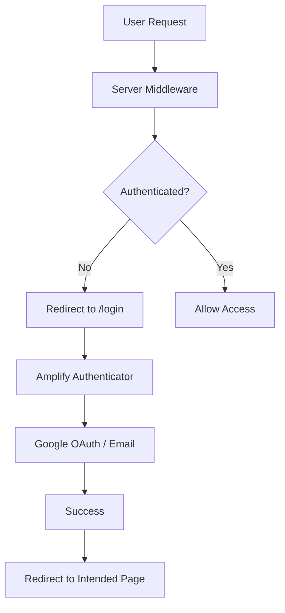

# 8P3P Learning Management System (LMS)

<div align="center">
  
  
  <p><strong>A production-ready LMS platform for EMDR therapist training</strong></p>
  
  [](https://nextjs.org/)
  [](https://www.typescriptlang.org/)
  [](https://aws.amazon.com/amplify/)
  [](https://tailwindcss.com/)
</div>

## 🚀 Features

### 🔐 **Complete Authentication System**

- **Multi-layer Security**: Server-side middleware + client-side protection
- **Social Login**: Google OAuth integration
- **Session Management**: Automatic timeout handling and session recovery
- **MFA Support**: Optional SMS-based multi-factor authentication
- **Smart Redirects**: Preserves intended destination after login

### 📚 **Enhanced Learning Management**

- **Course Catalog**: Browse and enroll in EMDR training courses
- **Smart Course Navigation**: Auto-expanding sidebar with active chapter detection
- **Simple Progress Tracking**: Chapter-based completion tracking with visual indicators
- **Interactive Dashboard**: Personalized learning dashboard with widgets
- **Enhanced Quiz System**:
  - Pass/fail feedback with conditional navigation
  - "Next Chapter" button on quiz success
  - "Retry Quiz" + "Ask Question" on failure
  - Question interaction tracking per chapter
- **AI-Powered Help**: Modal-based question system (Tavus AI ready)
- **Community Features**: Social learning with posts and interactions
- **SEO-Friendly URLs**: Human-readable slugs with reliable ID references
- **Hierarchical Structure**: Organized sections and chapters with auto-collapse

### ⏱️ **MVP Time Management System**

- **Simple Time Estimation**: Basic formula for course completion times
  - `totalTime = videoTime + quizTime + learningCheckTime`
  - Default 8-minute chapters with configurable quiz/learning check times
- **Progress Calculation**: Two simple approaches
  - Time-based: `(timeSpent / totalTime) * 100`
  - Chapter-based: `(completedChapters / totalChapters) * 100`
- **Reusable Timer Component**: 
  - Countdown timers for quizzes and learning activities
  - Multiple variants (compact, default, large)
  - Built with shadcn countdown hook for reliability

### 🎨 **Modern UI/UX**

- **Responsive Design**: Mobile-first approach with adaptive layouts
- **Consistent Progress Indicators**: Reusable ChapterProgress component
- **Smart Sidebar**: Only active section expanded, others auto-collapsed
- **Modal System**: Accessible dialogs with proper ARIA support
- **Dark/Light Themes**: CSS-first theming with next-themes integration
- **Accessibility**: WCAG compliant components and navigation
- **Loading States**: Smooth transitions and professional loading indicators
- **Interactive Video Player**: Custom video controls with progress tracking
- **Breadcrumb Navigation**: Clear hierarchical navigation paths
- **Timer Components**: Comprehensive timer system for quizzes, AI interactions, and progress tracking
- **Content Estimation System**: AI-powered time estimation for reading and video content with personalized learning recommendations

## 🛠️ Tech Stack

| Category             | Technology                               |
| -------------------- | ---------------------------------------- |
| **Framework**        | Next.js 15 (App Router)                  |
| **Language**         | TypeScript 5.9                           |
| **Authentication**   | AWS Amplify Gen2 + Cognito               |
| **Styling**          | TailwindCSS v4 + shadcn/ui + next-themes |
| **Forms**            | React Hook Form + Zod                    |
| **State Management** | React Context + useState                 |
| **Code Quality**     | ESLint + TypeScript strict mode          |
| **Deployment**       | AWS Amplify Hosting                      |

## 🏃‍♂️ Quick Start

### Prerequisites

- Node.js 18+ and npm
- AWS Account (for authentication)
- Git
- Radix UI components (@radix-ui/react-slider, @radix-ui/react-radio-group)

### 1. Clone & Install

```bash
git clone https://github.com/your-org/8p3p-lms-nextjs.git
cd 8p3p-lms-nextjs
npm install
```

### 2. Environment Setup

```bash
# Start Amplify sandbox (handles auth backend)
npx ampx sandbox

# In another terminal, start development server
npm run dev

# Optional: Run linting and type checking
npm run lint
npm run type-check
```

### 3. Open Application

Visit [http://localhost:3000](http://localhost:3000)

## 🔐 Authentication Flow

### Architecture Overview



### Security Layers

#### 🛡️ **Layer 1: Server-Side Protection**

- **Middleware**: `middleware.ts` validates sessions before page load
- **API Routes**: Protected endpoints with server-side auth checks
- **Cannot be bypassed**: Works even with JavaScript disabled

#### 🎯 **Layer 2: Client-Side Enhancement**

- **Route Guards**: `ProtectedRoute` components for smooth UX
- **Session Handling**: Automatic session timeout detection
- **Smart Redirects**: Preserves user's intended destination

#### 🔒 **Layer 3: Component-Level**

- **Conditional Rendering**: Auth-aware UI components
- **Loading States**: Professional loading indicators during auth checks
- **Error Boundaries**: Graceful error handling and recovery

### User Flows

#### 🆕 **New User Registration**

1. Visit protected route (e.g., `/dashboard`) → Redirect to `/login`
2. Click "Create Account" → Fill registration form
3. Email verification → Account confirmed
4. Automatic redirect to originally requested page

#### 🔄 **Returning User Login**

1. Visit `/login` or click "Login" in navbar
2. Choose email/password or Google OAuth
3. Successful authentication → Redirect to `/dashboard`
4. Session persists across browser sessions

#### ⏰ **Session Management**

1. Session expires → Automatic detection
2. User redirected to `/login` with return path stored
3. After re-authentication → Return to original page
4. Logout → Clear session and redirect to `/login`

## 🧪 MVP Testing Strategy

### Q&A Testing Approach (MVP Focus)

For rapid MVP development, we prioritize manual Q&A testing over comprehensive unit testing:

#### ✅ **Manual Testing Scenarios**

**Route Protection:**
1. Visit protected routes without login → Should redirect to `/login`
2. Login and access protected routes → Should work normally
3. Logout → Should clear session and redirect appropriately

**Course Navigation:**
1. Browse course catalog → All courses should display correctly
2. Navigate through chapters → Progress should update
3. Complete quizzes → Should track completion status

**Timer Functionality:**
1. Start quiz timer → Should countdown properly
2. Timer expiration → Should trigger appropriate actions
3. Different timer variants → Should display correctly

#### ✅ **Code Quality Checks**

```bash
# Run linting (enforced in CI/CD)
npm run lint:strict

# Run type checking
npm run type-check

# Validate build
npm run validate
```

#### ✅ **Post-MVP Testing Plan**

After feature completion, we'll implement:
- Comprehensive unit test suite
- Integration tests for key workflows  
- End-to-end testing with Playwright
- Performance and accessibility testing

## 📁 Project Structure

```
8p3p-lms-nextjs/
├── 📁 amplify/                 # AWS Amplify backend configuration
│   ├── auth/resource.ts        # Authentication setup
│   └── backend.ts              # Backend entry point
├── 📁 src/
│   ├── 📁 app/                 # Next.js App Router
│   │   ├── 📁 (auth)/         # Auth route group
│   │   │   └── login/         # Login page
│   │   ├── 📁 dashboard/      # Protected dashboard
│   │   ├── 📁 courses/        # Protected courses
│   │   │   └── 📁 [id]/       # Course detail pages
│   │   │       └── 📁 [sectionId]/  # Section pages
│   │   │           └── 📁 chapters/  # Chapter content
│   │   │               └── 📁 [chapterId]/  # Individual chapters
│   │   ├── 📁 api/            # API routes
│   │   │   └── user/          # Protected user endpoint
│   │   └── layout.tsx         # Root layout with auth provider
│   ├── 📁 components/         # Reusable components
│   │   ├── 📁 auth/           # Authentication components
│   │   │   ├── AuthProvider.tsx      # Amplify provider wrapper
│   │   │   ├── ProtectedRoute.tsx    # Client-side route guard
│   │   │   ├── AuthRedirect.tsx      # Login page redirect logic
│   │   │   ├── SessionHandler.tsx    # Session timeout handler
│   │   │   └── SignIn.tsx            # Amplify authenticator
│   │   ├── 📁 course/         # Course components
│   │   │   ├── course-sidebar.tsx    # Course navigation sidebar
│   │   │   ├── course-overview.tsx   # Course overview page
│   │   │   ├── breadcrumb-nav.tsx    # Breadcrumb navigation
│   │   │   └── 📁 chapter-content/   # Chapter components
│   │   │       ├── index.tsx         # Main chapter wrapper
│   │   │       ├── video-player.tsx  # Video player component
│   │   │       ├── interactive-script.tsx # Transcript component
│   │   │       ├── chapter-quiz.tsx  # Quiz component
│   │   │       └── ask-question.tsx  # Question form component
│   │   ├── 📁 common/         # Common reusable components
│   │   │   └── 📁 timer/      # Timer component system
│   │   │       ├── Timer.tsx          # Main timer component (Client)
│   │   │       └── TimerDisplay.tsx   # Timer display (Server)
│   │   └── 📁 ui/             # shadcn/ui components
│   ├── 📁 hooks/              # Custom React hooks
│   │   ├── useTimer.ts        # Timer hook with state management
│   │   ├── use-mobile.ts      # Mobile detection hook
│   │   └── use-params.ts      # Next.js 15+ params hook
│   ├── 📁 lib/                # Utility functions
│   │   ├── auth-server.ts     # Server-side auth utilities
│   │   ├── course-utils.ts    # Course utility functions
│   │   ├── mock-data.ts       # Mock data for development
│   │   ├── utils.ts           # General utilities
│   │   └── 📁 utils/          # Utility modules
│   │       └── time-formatting.ts # Time formatting and validation
│   └── amplify_outputs.json   # Amplify configuration
├── 📁 context/              # Documentation and context
│   ├── course-page-structure.md  # Course page structure guide
│   └── url-slugs-guide.md    # URL slug implementation guide
├── middleware.ts              # Server-side route protection
├── eslint.config.mjs          # ESLint configuration for Next.js 15+
├── amplify_outputs.json       # Root Amplify config
└── package.json
```

## 🚀 Deployment

### AWS Amplify (Recommended)

```bash
# Deploy to AWS Amplify
npx ampx pipeline-deploy --branch main
```

### Manual Deployment

```bash
# Lint and type check before building
npm run lint
npm run type-check

# Build for production
npm run build

# Start production server
npm start
```

## 🛠️ Development Workflow

### Pre-commit Validation

Run local checks before pushing to prevent CI/CD failures:

```bash
# Run all validation checks locally
npm run pre-commit

# Individual checks
npm run lint
npm run type-check
npm run build
```

### CI/CD Pipeline

Automated validation on every PR and push:

- **ESLint**: Code quality and style checking
- **TypeScript**: Type safety validation
- **Build**: Production build verification
- **Caching**: Optimized with Node.js 20 and enhanced caching
- **Security**: Minimal permissions and concurrency control

## 🔧 Configuration

### Environment Variables

```bash
# .env.local (auto-generated by Amplify)
NEXT_PUBLIC_AWS_PROJECT_REGION=<your-region>
NEXT_PUBLIC_AWS_COGNITO_REGION=<your-region>
# ... other Amplify-generated variables
```

### Theme System Configuration

The theme system uses **Tailwind CSS v4** with a dual-layer approach for maximum flexibility:

#### 🎨 **Adding New Colors**

1. **Define in `@theme` directive** (required for Tailwind v4):

```css
/* src/app/globals.css */
@theme {
	/* Add your new color with both light and dark variants */
	--color-success: oklch(67.31% 0.162 144.21);
	--color-success-dark: oklch(55% 0.15 144);
	--color-success-foreground: oklch(100% 0 0);
	--color-success-foreground-dark: oklch(0% 0 0);
}
```

2. **Reference in CSS custom properties** (for runtime theme switching):

```css
:root {
	--success: var(--color-success);
	--success-foreground: var(--color-success-foreground);
}

.dark {
	--success: var(--color-success-dark);
	--success-foreground: var(--color-success-foreground-dark);
}
```

3. **Use in components**:

```tsx
// As Tailwind utility
<div className="bg-success text-success-foreground">Success message</div>

// As CSS variable
<div style={{ backgroundColor: 'var(--success)' }}>Success message</div>
```

#### 🌈 **Brand Color System**

Brand colors are pre-defined and available as both utilities and CSS variables:

```css
/* Available brand colors */
--color-brand-blue: oklch(28.08% 0.051 260.2); /* Primary brand */
--color-brand-gold: oklch(76.65% 0.139 91.06); /* Accent/CTA */
--color-brand-gray: oklch(71.37% 0.019 261.32); /* Neutral */
--color-brand-light-blue: oklch(96.53% 0.007 247.9); /* Backgrounds */
--color-brand-green: oklch(67.31% 0.162 144.21); /* Success */
--color-brand-red: oklch(64.27% 0.215 28.81); /* Error/Warning */
```

Usage:

```tsx
<button className="bg-brand-gold text-brand-blue">CTA Button</button>
```

#### 🔧 **Extending shadcn/ui Components**

To customize shadcn/ui component colors:

1. **Modify the base theme colors** in `@theme` directive
2. **Components automatically inherit** the new colors
3. **Override specific components** using CSS custom properties:

```css
/* Override specific component styling */
@layer components {
	.custom-button {
		background-color: var(--color-brand-gold);
		color: var(--color-brand-blue);
	}
}
```

#### ⚡ **Production Build Requirements**

**Critical**: All theme colors must be defined in the `@theme` directive for Tailwind v4 production builds:

```css
/* ✅ CORRECT - Will work in production */
@theme {
	--color-custom: oklch(50% 0.1 180);
}

/* ❌ INCORRECT - Will be stripped in production */
:root {
	--custom-color: #somecolor;
}
```

### Authentication Settings

Edit `amplify/auth/resource.ts` to customize:

- User attributes (email, name, custom fields)
- Password policies
- MFA settings
- OAuth providers
- Callback URLs

### External Identity Providers Setup

#### Google OAuth 2.0 Configuration

**Required**: Configure Google OAuth 2.0 Console with Cognito user pool domains when deploying to new environments:

1. **Visit Google Cloud Console**: [console.cloud.google.com](https://console.cloud.google.com)
2. **Navigate to**: APIs & Services → Credentials → OAuth 2.0 Client IDs
3. **Select your OAuth client** and click the **Edit** button

#### **Step 1: Configure Authorized JavaScript Origins**

Add your **Cognito user pool domains** (not your app URLs):

```bash
# From amplify_outputs.json - check your actual domains
https://<your-local-user-pool-domain>.auth.<region>.amazoncognito.com #local dev
https://<your-main-user-pool-domain>.auth.<region>.amazoncognito.com #main branch
https://<your-dev-user-pool-domain>.auth.<region>.amazoncognito.com #dev branch
```

#### **Step 2: Configure Authorized Redirect URIs**

Add your **Cognito user pool domains** with `/oauth2/idpresponse` endpoint:

```bash
# From amplify_outputs.json - check your actual domains
https://<your-local-user-pool-domain>.auth.<region>.amazoncognito.com/oauth2/idpresponse #local dev
https://<your-main-user-pool-domain>.auth.<region>.amazoncognito.com/oauth2/idpresponse #main branch
https://<your-dev-user-pool-domain>.auth.<region>.amazoncognito.com/oauth2/idpresponse #dev branch
```

#### **Step 3: Find Your Cognito Domains**

**Method 1: From amplify_outputs.json (Local Development)**

```bash
# Check your amplify_outputs.json file
cat amplify_outputs.json | grep "domain"
```

**Method 2: From AWS Amplify Console (Deployed Branches)**

For each deployed branch, follow these steps to find the Cognito User Pool domain:

1. **Navigate to Branch Deployments**:

   ```
   # Replace with your actual region, app ID, and branch name
   https://<region>.console.aws.amazon.com/amplify/apps/<your-app-id>/branches/main/deployments
   https://<region>.console.aws.amazon.com/amplify/apps/<your-app-id>/branches/dev/deployments
   ```

2. **Access Backend Resources**:
   - Scroll down to find the **"Deployed backend Resources"** tab
   - Click on the tab to expand the resources table

3. **Locate User Pool**:
   - In the search bar, type: `UserPool`
   - Find and click on **"AWS::Cognito::UserPool"** in the **"Type"** column

4. **Find Domain Settings**:
   - A new browser window opens to AWS Cognito Console
   - In the left sidebar, click **"Domain"** under the **"Branding"** section
   - Copy the **"Cognito Domain"** from the main content area

**Example Cognito domains by branch**:

```bash
# Local Development (from amplify_outputs.json)
https://<local-user-pool-id>.auth.<region>.amazoncognito.com

# Main Branch (from AWS Console)
https://<main-user-pool-id>.auth.<region>.amazoncognito.com

# Dev Branch (from AWS Console)
https://<dev-user-pool-id>.auth.<region>.amazoncognito.com
```

#### **Step 4: Configure Secrets**

In AWS Amplify Console → Secrets:

```
# Replace with your actual region and app ID
https://<region>.console.aws.amazon.com/amplify/apps/<your-app-id>/secrets
```

Add the following secrets:

- `GOOGLE_CLIENT_ID`: Your Google OAuth client ID
- `GOOGLE_CLIENT_SECRET`: Your Google OAuth client secret

**Reference**: [AWS Amplify External Identity Providers Guide](https://docs.amplify.aws/nextjs/build-a-backend/auth/concepts/external-identity-providers/)

### Timer Components System

Comprehensive timer functionality for quizzes, AI interactions, and progress tracking:

#### 🕐 **Core Timer Features**

- **Multiple Variants**: Countdown, stopwatch, and progress timers
- **Accurate Timing**: High-resolution timestamps with tab visibility handling
- **Accessibility**: Full WCAG compliance with screen reader support
- **Keyboard Controls**: Spacebar/Enter to toggle, Ctrl+R to reset, Escape to pause
- **Visual Indicators**: Color-coded urgency (green → yellow → red)
- **Context Validation**: Different time limits for quiz, AI, learning, and general contexts

#### 🧩 **Component Architecture**

```typescript
// Main Timer Component (Client Component)
<Timer
  duration={300}                    // 5 minutes
  variant="countdown"               // countdown | stopwatch | progress
  context="quiz"                    // quiz | ai | learning | general
  showControls                      // Play/pause/reset buttons
  showProgress                      // Progress bar for progress variant
  onComplete={handleSubmit}         // Callback when timer completes
  onTick={updateState}             // Callback every second
/>

// Compact Timer (for navigation/cards)
<CompactTimer
  duration={240}                    // 4 minutes
  variant="countdown"
  context="ai"
  autoStart
/>

// Timer Display Only (Server Component)
<TimerDisplay
  time={180}                        // Current time in seconds
  color="warning"                   // Visual urgency indicator
  showLabel                         // "3 minutes remaining"
  size="lg"                         // sm | md | lg
/>
```

#### ⚙️ **Timer Hook Usage**

```typescript
// Custom timer logic with full control
const timer = useTimer(300, {
  variant: "countdown",
  autoStart: true,
  onComplete: () => submitQuiz(),
  onTick: (state) => updateProgress(state.progress)
});

// Timer state and controls
const {
  time,                    // Current time (seconds)
  isRunning,              // Timer running state
  isPaused,               // Timer paused state
  isCompleted,            // Timer completed state
  progress,               // Progress percentage (0-100)
  start, pause, resume,   // Control functions
  reset, toggle,          // Control functions
  getFormattedTime,       // "05:30" format
  getTimeWithLabel,       // "5 minutes 30 seconds remaining"
  getColorTheme           // "success" | "warning" | "danger"
} = timer;
```

#### 🎯 **Context-Specific Validation**

```typescript
// Automatic validation based on context
validateTimerDuration(300, "quiz")     // ✅ Valid (30s - 1hr)
validateTimerDuration(600, "ai")       // ❌ Too long (1min - 5min)
validateTimerDuration(30, "learning")  // ❌ Too short (1min - 30min)
validateTimerDuration(7200, "general") // ✅ Valid (1s - 2hr)
```

#### 🔧 **Time Formatting Utilities**

```typescript
formatTime(90)                          // "01:30"
formatTime(3661, true)                  // "1:01:01"
formatTimeWithLabel(90, "remaining")    // "1 minute 30 seconds remaining"
calculateProgress(30, 60)               // 50 (percent)
getTimerColorTheme(10, 60)             // "danger" (< 25% remaining)
```

### Data Models

Enhanced tracking capabilities:

```typescript
// Chapter completion tracking
interface Chapter {
	videoCompleted?: boolean;
	quizPassed?: boolean;
	questionAskedCount?: number;
	timeSpent?: number;              // Time spent in seconds
	quizAttempts?: number;           // Number of quiz attempts
}

// Course progress tracking
interface Course {
	lastViewedChapter?: string;
	completedChapters: string[];
	totalTimeSpent?: number;         // Total learning time
	averageQuizScore?: number;       // Average quiz performance
}

// Timer interaction tracking
interface TimerSession {
	context: "quiz" | "ai" | "learning";
	duration: number;                // Configured duration
	timeUsed: number;               // Actual time used
	completed: boolean;             // Whether timer completed naturally
	pauseCount?: number;            // Number of pauses
}
```

## 🤝 Contributing

We welcome contributions! Please see our [**Contributing Guide**](CONTRIBUTING.md) for detailed information on:

- 🚀 **Getting Started**: Setup and development workflow
- 📝 **PR Guidelines**: Stacked PRs, size limits, and review process
- 🧪 **Testing Standards**: Required tests and validation
- 📋 **Code Quality**: Standards, comments, and best practices
- 🔄 **Release Process**: Sprint-based development and deployment

### Quick Start
1. Fork the repository
2. Create feature branch (`git checkout -b feature/amazing-feature`)
3. **Run pre-commit checks** (`npm run pre-commit`)
4. Commit changes (`git commit -m 'Add amazing feature'`)
5. Push to branch (`git push origin feature/amazing-feature`)
6. Open Pull Request

**📖 For detailed guidelines, see [CONTRIBUTING.md](CONTRIBUTING.md)**

### Code Quality Standards

- **Next.js 15+ Compliance**: Server components first, client only when needed
- **Data Schema Compliance**: Update mock-data models for new state/properties
- **Dependency Compliance**: Verify required packages before implementation
- **Pre-commit Validation**: All checks must pass locally before pushing
- **ESLint Rules**: Strict enforcement with no unused variables/imports

### Development Rules

- **Server Components**: Default choice for better performance
- **Client Components**: Only for interactivity (useState, event handlers, browser APIs)
- **Link Navigation**: Use Next.js Link instead of useRouter when possible
- **Route Parameters**:
  - **Server Components**: Use `await params` directly
  - **Client Components**: Use `useParams` hook from `@/hooks/use-params`
  - **NEVER**: Use React.use() directly - always use established patterns
- **Component Reuse**: Leverage existing components (ChapterProgress, etc.)
- **TypeScript Compliance**: Layout props must use Promise-only params type for Next.js 15+

## 📊 Content Estimation System

### Overview

The Content Estimation System provides intelligent time estimation for mixed educational content (text + video) with personalized learning recommendations. Built following our component reusability protocol using existing timer infrastructure and shadcn/ui components.

### Features

#### 🧠 **Smart Content Analysis**
- **Text Analysis**: Word count, reading speed calculation (150-250 WPM), complexity assessment
- **Video Analysis**: Duration parsing, type classification (lecture/demo/interactive), engagement factors
- **Mixed Content**: Combined analysis with interaction time calculation
- **Complexity Detection**: Simple/Moderate/Complex classification based on technical terms and structure

#### 👤 **Personalization Engine**
- **User Profiles**: Reading speed tracking, completion rate history, learning pace preferences
- **Adaptive Estimates**: Personalized time calculations based on user performance
- **Confidence Scoring**: Reliability assessment for time estimates (0-1 scale)
- **Profile Updates**: Automatic learning from actual completion times

#### 🎯 **Learning Recommendations**
- **Session Planning**: Optimal session length and break frequency suggestions
- **Pace Recommendations**: Fast/Moderate/Slow based on content complexity and user profile
- **Progress Tracking**: Real-time progress monitoring with remaining time calculations

### Components

#### Core Analysis Engine
```typescript
// Text analysis with complexity detection
import { analyzeTextContent } from '@/lib/content-analysis';
const analysis = analyzeTextContent(content);

// Video analysis with engagement factors
import { analyzeVideoContent } from '@/lib/content-analysis';
const videoAnalysis = analyzeVideoContent(metadata);

// Complete time estimation
import { calculateTimeEstimate } from '@/lib/content-analysis';
const estimate = calculateTimeEstimate(mixedContent, userProfile);
```

#### UI Components
```typescript
// Time estimate display (multiple variants)
import { TimeEstimate } from '@/components/common/content-estimation';
<TimeEstimate 
  estimate={estimate} 
  variant="detailed" 
  showBreakdown={true} 
  complexity="moderate" 
/>

// Content estimator with analysis
import { ContentEstimator } from '@/components/common/content-estimation';
<ContentEstimator 
  content={mixedContent}
  userProfile={userProfile}
  onEstimateReady={(estimate) => console.log(estimate)}
  trackProgress={true}
/>

// Progress tracking
import { ProgressIndicator } from '@/components/common/progress';
<ProgressIndicator 
  progress={45}
  estimatedTime={1800}
  elapsedTime={810}
  variant="linear"
/>
```

#### Custom Hooks
```typescript
// Content estimation with caching
import { useContentEstimation } from '@/hooks/useContentEstimation';
const { estimate, isLoading, error, analyze } = useContentEstimation({
  content: mixedContent,
  userProfile: userProfile,
  autoAnalyze: true
});

// Progress tracking
import { useProgressTracking } from '@/hooks/useContentEstimation';
const { 
  elapsedTime, 
  remainingTime, 
  progress, 
  startTracking, 
  stopTracking 
} = useProgressTracking(estimatedTime);
```

### Integration Examples

#### Basic Usage
```typescript
import { ContentEstimator } from '@/components/common/content-estimation';

function LessonPage({ lesson }) {
  const handleEstimateReady = (estimate) => {
    console.log(`Estimated time: ${estimate.total} seconds`);
    console.log(`Confidence: ${estimate.confidence * 100}%`);
  };

  return (
    <div>
      <ContentEstimator
        content={{
          text: lesson.content,
          videos: lesson.videos,
          contentType: "lesson"
        }}
        userProfile={user.learningProfile}
        onEstimateReady={handleEstimateReady}
        variant="card"
        showBreakdown={true}
      />
    </div>
  );
}
```

#### Advanced Usage with Progress Tracking
```typescript
import { useContentEstimation, useProgressTracking } from '@/hooks/useContentEstimation';

function InteractiveLearningSession({ content, userProfile }) {
  const { estimate, isLoading } = useContentEstimation({
    content,
    userProfile,
    autoAnalyze: true
  });

  const {
    progress,
    elapsedTime,
    remainingTime,
    startTracking,
    stopTracking,
    updateProgress
  } = useProgressTracking(estimate?.total || 0);

  const handleStartLearning = () => {
    startTracking();
  };

  const handleProgressUpdate = (completionPercentage) => {
    updateProgress(completionPercentage);
  };

  return (
    <div>
      {estimate && (
        <ProgressIndicator
          progress={progress}
          estimatedTime={estimate.total}
          elapsedTime={elapsedTime}
          variant="linear"
          showTimeRemaining={true}
        />
      )}
    </div>
  );
}
```

### Development & Integration

The MVP system focuses on simple, reliable functionality:
- **Basic time calculations** using configurable constants
- **Reusable timer component** with multiple variants
- **Simple progress tracking** based on chapter completion
- **Q&A testing approach** for rapid iteration

```bash
# Validate code quality
npm run validate

# Run development server
npm run dev
```

### Mock Data

Comprehensive mock data available for development and testing:

```typescript
import { 
  mockLessons, 
  mockUserProfiles, 
  mockTimeEstimates 
} from '@/lib/mock-data/content-estimation';

// Use in development
const estimate = mockTimeEstimates.mediumLesson;
const userProfile = mockUserProfiles.fastReader;
const content = mockLessons.comprehensiveChapter;
```

## 🐛 Troubleshooting

### Common Issues

#### Build Errors

```bash
# Fix TypeScript errors
npm run type-check

# Fix linting issues
npm run lint:fix

# Clean build
rm -rf .next && npm run build
```

#### Tailwind CSS v4 Production Build Issues

```bash
# CSS variable recognition errors in production
# Root cause: Custom CSS variables not integrated with Tailwind v4 theme system
# Solution: Define colors in @theme directive using --color-* namespace

# Check for CSS variable issues
grep -r "var(--" src/ --include="*.css"

# Verify Tailwind v4 theme configuration
# Ensure colors are defined in @theme { --color-* } format
# Reference: docs/design-system-rules.md#tailwind-v4-production-build-issues
```

#### TypeScript Layout Constraint Errors

```bash
# Common issue: Layout params type incompatible with Next.js 15+
# Solution: Use Promise<{ id: string }> instead of union types
# Client components: Use useParams hook from @/hooks/use-params
# Server components: Use await params directly
```

#### Missing Dependencies

```bash
# Install shadcn/ui components
npx shadcn@latest add dialog
npx shadcn@latest add progress

# Verify package.json dependencies
npm ci
```

#### Authentication Issues

```bash
# Restart Amplify sandbox
npx ampx sandbox --delete
npx ampx sandbox
```

## 📝 License

MIT License - see [LICENSE](LICENSE) file for details.

## 🆘 Support

- 📧 **Email**: support@8p3p.io
- 📖 **Documentation (coming soon)**: [docs.8p3p.io](https://docs.8p3p.io)
- 🐛 **Issues**: [GitHub Issues](https://github.com/rhyanvargas/8p3p-lms-nextjs/issues)
- 💬 **Discussions**: [GitHub Discussions](https://github.com/rhyanvargas/8p3p-lms-nextjs/discussions)

---

<div align="center">
  <p>Built with ❤️ by <a href="https://github.com/rhyanvargas">Rhyan Vargas</a> and <a href="https://8p3pdemo.com">8P3P</a></p>
  <p>© 2025 8P3P</p>
</div>
