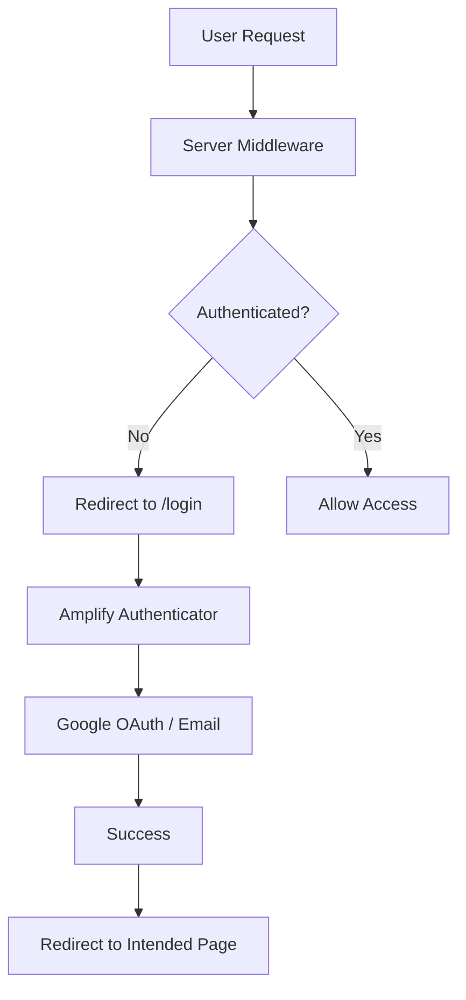

# 8P3P Learning Management System (LMS)

<div align="center">
  
  
  <p><strong>A production-ready LMS platform for EMDR therapist training</strong></p>
  
  [](https://nextjs.org/)
  [](https://www.typescriptlang.org/)
  [](https://aws.amazon.com/amplify/)
  [](https://tailwindcss.com/)
</div>

## 🚀 Features

### 🔐 **Complete Authentication System**

- **Multi-layer Security**: Server-side middleware + client-side protection
- **Social Login**: Google OAuth integration
- **Session Management**: Automatic timeout handling and session recovery
- **MFA Support**: Optional SMS-based multi-factor authentication
- **Smart Redirects**: Preserves intended destination after login

### 📚 **Enhanced Learning Management**

- **Course Catalog**: Browse and enroll in EMDR training courses
- **Smart Course Navigation**: Auto-expanding sidebar with active chapter detection
- **Progress Tracking**: Real-time completion tracking with visual indicators
- **Interactive Dashboard**: Personalized learning dashboard with widgets
- **Enhanced Quiz System**: 
  - Pass/fail feedback with conditional navigation
  - "Next Chapter" button on quiz success
  - "Retry Quiz" + "Ask Question" on failure
  - Question interaction tracking per chapter
- **AI-Powered Help**: Modal-based question system (Tavus AI ready)
- **Community Features**: Social learning with posts and interactions
- **SEO-Friendly URLs**: Human-readable slugs with reliable ID references
- **Hierarchical Structure**: Organized sections and chapters with auto-collapse

### 🎨 **Modern UI/UX**

- **Responsive Design**: Mobile-first approach with adaptive layouts
- **Consistent Progress Indicators**: Reusable ChapterProgress component
- **Smart Sidebar**: Only active section expanded, others auto-collapsed
- **Modal System**: Accessible dialogs with proper ARIA support
- **Dark/Light Themes**: CSS-first theming with next-themes integration
- **Accessibility**: WCAG compliant components and navigation
- **Loading States**: Smooth transitions and professional loading indicators
- **Interactive Video Player**: Custom video controls with progress tracking
- **Breadcrumb Navigation**: Clear hierarchical navigation paths

## 🛠️ Tech Stack

| Category             | Technology                         |
| -------------------- | ---------------------------------- |
| **Framework**        | Next.js 15 (App Router)            |
| **Language**         | TypeScript 5.9                     |
| **Authentication**   | AWS Amplify Gen2 + Cognito         |
| **Styling**          | TailwindCSS v4 + shadcn/ui + next-themes |
| **Forms**            | React Hook Form + Zod              |
| **State Management** | React Context + useState           |
| **Code Quality**     | ESLint + TypeScript strict mode    |
| **Deployment**       | AWS Amplify Hosting                |

## 🏃‍♂️ Quick Start

### Prerequisites

- Node.js 18+ and npm
- AWS Account (for authentication)
- Git
- Radix UI components (@radix-ui/react-slider, @radix-ui/react-radio-group)

### 1. Clone & Install

```bash
git clone https://github.com/your-org/8p3p-lms-nextjs.git
cd 8p3p-lms-nextjs
npm install
```

### 2. Environment Setup

```bash
# Start Amplify sandbox (handles auth backend)
npx ampx sandbox

# In another terminal, start development server
npm run dev

# Optional: Run linting and type checking
npm run lint
npm run type-check
```

### 3. Open Application

Visit [http://localhost:3000](http://localhost:3000)

## 🔐 Authentication Flow

### Architecture Overview



### Security Layers

#### 🛡️ **Layer 1: Server-Side Protection**

- **Middleware**: `middleware.ts` validates sessions before page load
- **API Routes**: Protected endpoints with server-side auth checks
- **Cannot be bypassed**: Works even with JavaScript disabled

#### 🎯 **Layer 2: Client-Side Enhancement**

- **Route Guards**: `ProtectedRoute` components for smooth UX
- **Session Handling**: Automatic session timeout detection
- **Smart Redirects**: Preserves user's intended destination

#### 🔒 **Layer 3: Component-Level**

- **Conditional Rendering**: Auth-aware UI components
- **Loading States**: Professional loading indicators during auth checks
- **Error Boundaries**: Graceful error handling and recovery

### User Flows

#### 🆕 **New User Registration**

1. Visit protected route (e.g., `/dashboard`) → Redirect to `/login`
2. Click "Create Account" → Fill registration form
3. Email verification → Account confirmed
4. Automatic redirect to originally requested page

#### 🔄 **Returning User Login**

1. Visit `/login` or click "Login" in navbar
2. Choose email/password or Google OAuth
3. Successful authentication → Redirect to `/dashboard`
4. Session persists across browser sessions

#### ⏰ **Session Management**

1. Session expires → Automatic detection
2. User redirected to `/login` with return path stored
3. After re-authentication → Return to original page
4. Logout → Clear session and redirect to `/login`

## 🧪 Testing Authentication

### Manual Testing Scenarios

#### ✅ **Route Protection**

```bash
# Test 1: Protected routes redirect when not authenticated
curl -I http://localhost:3000/dashboard
# Expected: 307 redirect to /login

# Test 2: Public routes accessible without auth
curl -I http://localhost:3000/
# Expected: 200 OK
```

#### ✅ **API Protection**

```bash
# Test 3: Protected API returns 401 when not authenticated
curl http://localhost:3000/api/user
# Expected: {"success": false, "error": "Authentication required"}
```

#### ✅ **Session Persistence**

1. Login → Close browser → Reopen → Should remain logged in
2. Login → Wait for session timeout → Should redirect to login
3. Login → Logout → Should redirect to login page

#### ✅ **Google OAuth**

1. Click "Continue with Google" → Google consent screen
2. Approve permissions → Redirect to dashboard
3. User profile populated with Google data

#### ✅ **Smart Redirects**

1. Visit `/courses` while logged out → Redirect to `/login`
2. Complete login → Automatic redirect to `/courses`
3. Visit `/login` while logged in → Redirect to `/dashboard`

### Automated Testing

```bash
# Run linting
npm run lint

# Run type checking
npm run type-check

# Run authentication tests (when implemented)
npm run test:auth

# Run end-to-end tests
npm run test:e2e
```

## 📁 Project Structure

```
8p3p-lms-nextjs/
├── 📁 amplify/                 # AWS Amplify backend configuration
│   ├── auth/resource.ts        # Authentication setup
│   └── backend.ts              # Backend entry point
├── 📁 src/
│   ├── 📁 app/                 # Next.js App Router
│   │   ├── 📁 (auth)/         # Auth route group
│   │   │   └── login/         # Login page
│   │   ├── 📁 dashboard/      # Protected dashboard
│   │   ├── 📁 courses/        # Protected courses
│   │   │   └── 📁 [id]/       # Course detail pages
│   │   │       └── 📁 [sectionId]/  # Section pages
│   │   │           └── 📁 chapters/  # Chapter content
│   │   │               └── 📁 [chapterId]/  # Individual chapters
│   │   ├── 📁 api/            # API routes
│   │   │   └── user/          # Protected user endpoint
│   │   └── layout.tsx         # Root layout with auth provider
│   ├── 📁 components/         # Reusable components
│   │   ├── 📁 auth/           # Authentication components
│   │   │   ├── AuthProvider.tsx      # Amplify provider wrapper
│   │   │   ├── ProtectedRoute.tsx    # Client-side route guard
│   │   │   ├── AuthRedirect.tsx      # Login page redirect logic
│   │   │   ├── SessionHandler.tsx    # Session timeout handler
│   │   │   └── SignIn.tsx            # Amplify authenticator
│   │   ├── 📁 course/         # Course components
│   │   │   ├── course-sidebar.tsx    # Course navigation sidebar
│   │   │   ├── course-overview.tsx   # Course overview page
│   │   │   ├── breadcrumb-nav.tsx    # Breadcrumb navigation
│   │   │   └── 📁 chapter-content/   # Chapter components
│   │   │       ├── index.tsx         # Main chapter wrapper
│   │   │       ├── video-player.tsx  # Video player component
│   │   │       ├── interactive-script.tsx # Transcript component
│   │   │       ├── chapter-quiz.tsx  # Quiz component
│   │   │       └── ask-question.tsx  # Question form component
│   │   └── 📁 ui/             # shadcn/ui components
│   ├── 📁 lib/                # Utility functions
│   │   ├── auth-server.ts     # Server-side auth utilities
│   │   ├── course-utils.ts    # Course utility functions
│   │   ├── mock-data.ts       # Mock data for development
│   │   └── utils.ts           # General utilities
│   └── amplify_outputs.json   # Amplify configuration
├── 📁 context/              # Documentation and context
│   ├── course-page-structure.md  # Course page structure guide
│   └── url-slugs-guide.md    # URL slug implementation guide
├── middleware.ts              # Server-side route protection
├── eslint.config.mjs          # ESLint configuration for Next.js 15+
├── amplify_outputs.json       # Root Amplify config
└── package.json
```

## 🚀 Deployment

### AWS Amplify (Recommended)

```bash
# Deploy to AWS Amplify
npx ampx pipeline-deploy --branch main
```

### Manual Deployment

```bash
# Lint and type check before building
npm run lint
npm run type-check

# Build for production
npm run build

# Start production server
npm start
```

## 🛠️ Development Workflow

### Pre-commit Validation

Run local checks before pushing to prevent CI/CD failures:

```bash
# Run all validation checks locally
npm run pre-commit

# Individual checks
npm run lint
npm run type-check
npm run build
```

### CI/CD Pipeline

Automated validation on every PR and push:

- **ESLint**: Code quality and style checking
- **TypeScript**: Type safety validation
- **Build**: Production build verification
- **Caching**: Optimized with Node.js 20 and enhanced caching
- **Security**: Minimal permissions and concurrency control

## 🔧 Configuration

### Environment Variables

```bash
# .env.local (auto-generated by Amplify)
NEXT_PUBLIC_AWS_PROJECT_REGION=us-east-1
NEXT_PUBLIC_AWS_COGNITO_REGION=us-east-1
# ... other Amplify-generated variables
```

### Authentication Settings

Edit `amplify/auth/resource.ts` to customize:

- User attributes (email, name, custom fields)
- Password policies
- MFA settings
- OAuth providers
- Callback URLs

### Data Models

Enhanced tracking capabilities:

```typescript
// Chapter completion tracking
interface Chapter {
  videoCompleted?: boolean;
  quizPassed?: boolean;
  questionAskedCount?: number;
}

// Course progress tracking
interface Course {
  lastViewedChapter?: string;
  completedChapters: string[];
}
```

## 🤝 Contributing

1. Fork the repository
2. Create feature branch (`git checkout -b feature/amazing-feature`)
3. **Run pre-commit checks** (`npm run pre-commit`)
4. Commit changes (`git commit -m 'Add amazing feature'`)
5. Push to branch (`git push origin feature/amazing-feature`)
6. Open Pull Request

### Code Quality Standards

- **Next.js 15+ Compliance**: Server components first, client only when needed
- **Data Schema Compliance**: Update mock-data models for new state/properties
- **Dependency Compliance**: Verify required packages before implementation
- **Pre-commit Validation**: All checks must pass locally before pushing
- **ESLint Rules**: Strict enforcement with no unused variables/imports

### Development Rules

- **Server Components**: Default choice for better performance
- **Client Components**: Only for interactivity (useState, event handlers, browser APIs)
- **Link Navigation**: Use Next.js Link instead of useRouter when possible
- **Route Parameters**: 
  - **Server Components**: Use `await params` directly
  - **Client Components**: Use `useParams` hook from `@/hooks/use-params`
  - **NEVER**: Use React.use() directly - always use established patterns
- **Component Reuse**: Leverage existing components (ChapterProgress, etc.)
- **TypeScript Compliance**: Layout props must use Promise-only params type for Next.js 15+

## 🐛 Troubleshooting

### Common Issues

#### Build Errors
```bash
# Fix TypeScript errors
npm run type-check

# Fix linting issues
npm run lint:fix

# Clean build
rm -rf .next && npm run build
```

#### Tailwind CSS v4 Production Build Issues
```bash
# CSS variable recognition errors in production
# Root cause: Custom CSS variables not integrated with Tailwind v4 theme system
# Solution: Define colors in @theme directive using --color-* namespace

# Check for CSS variable issues
grep -r "var(--" src/ --include="*.css"

# Verify Tailwind v4 theme configuration
# Ensure colors are defined in @theme { --color-* } format
# Reference: docs/design-system-rules.md#tailwind-v4-production-build-issues
```

#### TypeScript Layout Constraint Errors
```bash
# Common issue: Layout params type incompatible with Next.js 15+
# Solution: Use Promise<{ id: string }> instead of union types
# Client components: Use useParams hook from @/hooks/use-params
# Server components: Use await params directly
```

#### Missing Dependencies
```bash
# Install shadcn/ui components
npx shadcn@latest add dialog
npx shadcn@latest add progress

# Verify package.json dependencies
npm ci
```

#### Authentication Issues
```bash
# Restart Amplify sandbox
npx ampx sandbox --delete
npx ampx sandbox
```

## 📝 License

MIT License - see [LICENSE](LICENSE) file for details.

## 🆘 Support

- 📧 **Email**: support@8p3p.io
- 📖 **Documentation**: [docs.8p3p.io](https://docs.8p3p.io)
- 🐛 **Issues**: [GitHub Issues](https://github.com/your-org/8p3p-lms-nextjs/issues)
- 💬 **Discussions**: [GitHub Discussions](https://github.com/your-org/8p3p-lms-nextjs/discussions)

---

<div align="center">
  <p>Built with ❤️ for EMDR therapist training</p>
  <p>© 2024 8P3P Training Platform</p>
</div>
