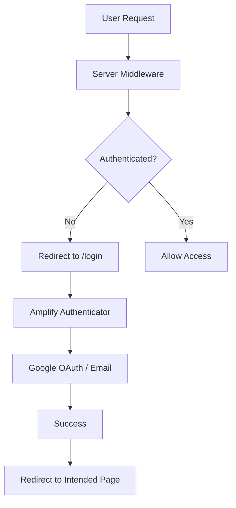

# 8P3P Learning Management System (LMS)

<div align="center">
  
  
  <p><strong>A production-ready LMS platform for EMDR therapist training</strong></p>
  
  [](https://nextjs.org/)
  [](https://www.typescriptlang.org/)
  [](https://aws.amazon.com/amplify/)
  [](https://tailwindcss.com/)
</div>

## 🚀 Features

### 🔐 **Complete Authentication System**
- **Multi-layer Security**: Server-side middleware + client-side protection
- **Social Login**: Google OAuth integration
- **Session Management**: Automatic timeout handling and session recovery
- **MFA Support**: Optional SMS-based multi-factor authentication
- **Smart Redirects**: Preserves intended destination after login

### 📚 **Learning Management**
- **Course Catalog**: Browse and enroll in EMDR training courses
- **Progress Tracking**: Real-time completion tracking and analytics
- **Interactive Dashboard**: Personalized learning dashboard with widgets
- **Quiz System**: Assessment tools with detailed results tracking
- **Community Features**: Social learning with posts and interactions

### 🎨 **Modern UI/UX**
- **Responsive Design**: Mobile-first approach with adaptive layouts
- **Dark/Light Themes**: Automatic theme switching support
- **Accessibility**: WCAG compliant components and navigation
- **Loading States**: Smooth transitions and professional loading indicators

## 🛠️ Tech Stack

| Category | Technology |
|----------|------------|
| **Framework** | Next.js 15 (App Router) |
| **Language** | TypeScript 5.9 |
| **Authentication** | AWS Amplify Gen2 + Cognito |
| **Styling** | TailwindCSS + shadcn/ui |
| **Forms** | React Hook Form + Zod |
| **State Management** | React Context + useState |
| **Deployment** | AWS Amplify Hosting |

## 🏃‍♂️ Quick Start

### Prerequisites
- Node.js 18+ and npm
- AWS Account (for authentication)
- Git

### 1. Clone & Install
```bash
git clone https://github.com/your-org/8p3p-lms-nextjs.git
cd 8p3p-lms-nextjs
npm install
```

### 2. Environment Setup
```bash
# Start Amplify sandbox (handles auth backend)
npx ampx sandbox

# In another terminal, start development server
npm run dev
```

### 3. Open Application
Visit [http://localhost:3000](http://localhost:3000)

## 🔐 Authentication Flow

### Architecture Overview


### Security Layers

#### 🛡️ **Layer 1: Server-Side Protection**
- **Middleware**: `middleware.ts` validates sessions before page load
- **API Routes**: Protected endpoints with server-side auth checks
- **Cannot be bypassed**: Works even with JavaScript disabled

#### 🎯 **Layer 2: Client-Side Enhancement**
- **Route Guards**: `ProtectedRoute` components for smooth UX
- **Session Handling**: Automatic session timeout detection
- **Smart Redirects**: Preserves user's intended destination

#### 🔒 **Layer 3: Component-Level**
- **Conditional Rendering**: Auth-aware UI components
- **Loading States**: Professional loading indicators during auth checks
- **Error Boundaries**: Graceful error handling and recovery

### User Flows

#### 🆕 **New User Registration**
1. Visit protected route (e.g., `/dashboard`) → Redirect to `/login`
2. Click "Create Account" → Fill registration form
3. Email verification → Account confirmed
4. Automatic redirect to originally requested page

#### 🔄 **Returning User Login**
1. Visit `/login` or click "Login" in navbar
2. Choose email/password or Google OAuth
3. Successful authentication → Redirect to `/dashboard`
4. Session persists across browser sessions

#### ⏰ **Session Management**
1. Session expires → Automatic detection
2. User redirected to `/login` with return path stored
3. After re-authentication → Return to original page
4. Logout → Clear session and redirect to `/login`

## 🧪 Testing Authentication

### Manual Testing Scenarios

#### ✅ **Route Protection**
```bash
# Test 1: Protected routes redirect when not authenticated
curl -I http://localhost:3000/dashboard
# Expected: 307 redirect to /login

# Test 2: Public routes accessible without auth
curl -I http://localhost:3000/
# Expected: 200 OK
```

#### ✅ **API Protection**
```bash
# Test 3: Protected API returns 401 when not authenticated
curl http://localhost:3000/api/user
# Expected: {"success": false, "error": "Authentication required"}
```

#### ✅ **Session Persistence**
1. Login → Close browser → Reopen → Should remain logged in
2. Login → Wait for session timeout → Should redirect to login
3. Login → Logout → Should redirect to login page

#### ✅ **Google OAuth**
1. Click "Continue with Google" → Google consent screen
2. Approve permissions → Redirect to dashboard
3. User profile populated with Google data

#### ✅ **Smart Redirects**
1. Visit `/courses` while logged out → Redirect to `/login`
2. Complete login → Automatic redirect to `/courses`
3. Visit `/login` while logged in → Redirect to `/dashboard`

### Automated Testing
```bash
# Run authentication tests (when implemented)
npm run test:auth

# Run end-to-end tests
npm run test:e2e
```

## 📁 Project Structure

```
8p3p-lms-nextjs/
├── 📁 amplify/                 # AWS Amplify backend configuration
│   ├── auth/resource.ts        # Authentication setup
│   └── backend.ts              # Backend entry point
├── 📁 src/
│   ├── 📁 app/                 # Next.js App Router
│   │   ├── 📁 (auth)/         # Auth route group
│   │   │   └── login/         # Login page
│   │   ├── 📁 dashboard/      # Protected dashboard
│   │   ├── 📁 courses/        # Protected courses
│   │   ├── 📁 api/            # API routes
│   │   │   └── user/          # Protected user endpoint
│   │   └── layout.tsx         # Root layout with auth provider
│   ├── 📁 components/         # Reusable components
│   │   ├── 📁 auth/           # Authentication components
│   │   │   ├── AuthProvider.tsx      # Amplify provider wrapper
│   │   │   ├── ProtectedRoute.tsx    # Client-side route guard
│   │   │   ├── AuthRedirect.tsx      # Login page redirect logic
│   │   │   ├── SessionHandler.tsx    # Session timeout handler
│   │   │   └── SignIn.tsx            # Amplify authenticator
│   │   └── 📁 ui/             # shadcn/ui components
│   ├── 📁 lib/                # Utility functions
│   │   ├── auth-server.ts     # Server-side auth utilities
│   │   └── utils.ts           # General utilities
│   └── amplify_outputs.json   # Amplify configuration
├── middleware.ts              # Server-side route protection
├── amplify_outputs.json       # Root Amplify config
└── package.json
```

## 🚀 Deployment

### AWS Amplify (Recommended)
```bash
# Deploy to AWS Amplify
npx ampx pipeline-deploy --branch main
```

### Manual Deployment
```bash
# Build for production
npm run build

# Start production server
npm start
```

## 🔧 Configuration

### Environment Variables
```bash
# .env.local (auto-generated by Amplify)
NEXT_PUBLIC_AWS_PROJECT_REGION=us-east-1
NEXT_PUBLIC_AWS_COGNITO_REGION=us-east-1
# ... other Amplify-generated variables
```

### Authentication Settings
Edit `amplify/auth/resource.ts` to customize:
- User attributes (email, name, custom fields)
- Password policies
- MFA settings
- OAuth providers
- Callback URLs

## 🤝 Contributing

1. Fork the repository
2. Create feature branch (`git checkout -b feature/amazing-feature`)
3. Commit changes (`git commit -m 'Add amazing feature'`)
4. Push to branch (`git push origin feature/amazing-feature`)
5. Open Pull Request

## 📝 License

MIT License - see [LICENSE](LICENSE) file for details.

## 🆘 Support

- 📧 **Email**: support@8p3p.io
- 📖 **Documentation**: [docs.8p3p.io](https://docs.8p3p.io)
- 🐛 **Issues**: [GitHub Issues](https://github.com/your-org/8p3p-lms-nextjs/issues)
- 💬 **Discussions**: [GitHub Discussions](https://github.com/your-org/8p3p-lms-nextjs/discussions)

---

<div align="center">
  <p>Built with ❤️ for EMDR therapist training</p>
  <p>© 2024 8P3P Training Platform</p>
</div>
